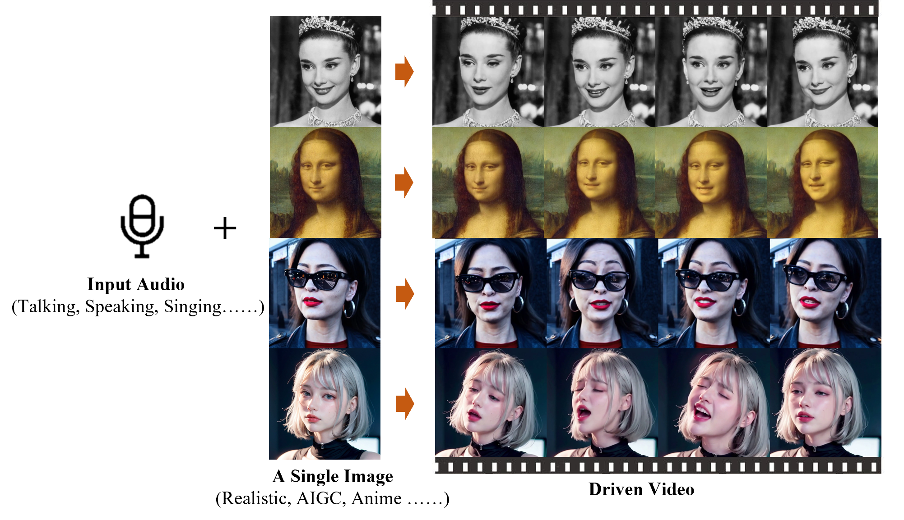

# EMO
Emote Portrait Alive: Generating Expressive Portrait Videos with Audio2Video Diffusion Model under Weak Conditions

Linrui Tian, Qi Wang, Bang Zhang, Liefeng Bo,

Institute for Intelligent Computing, Alibaba Group

